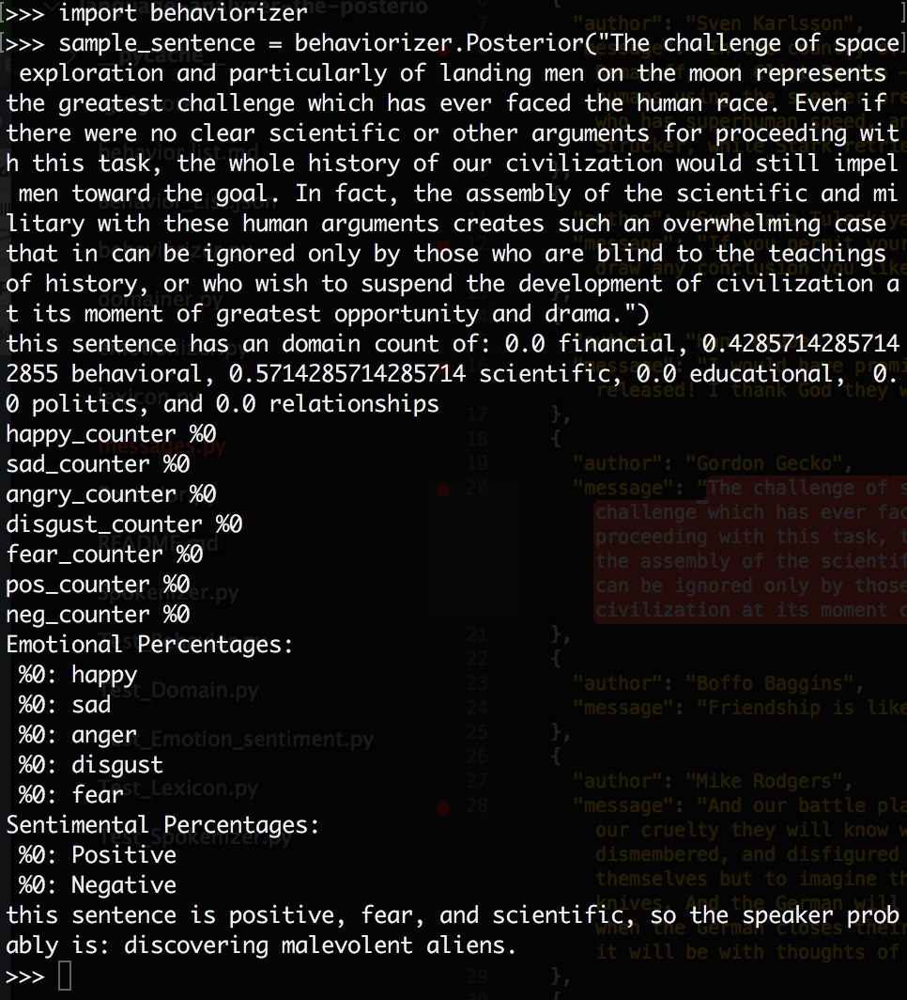
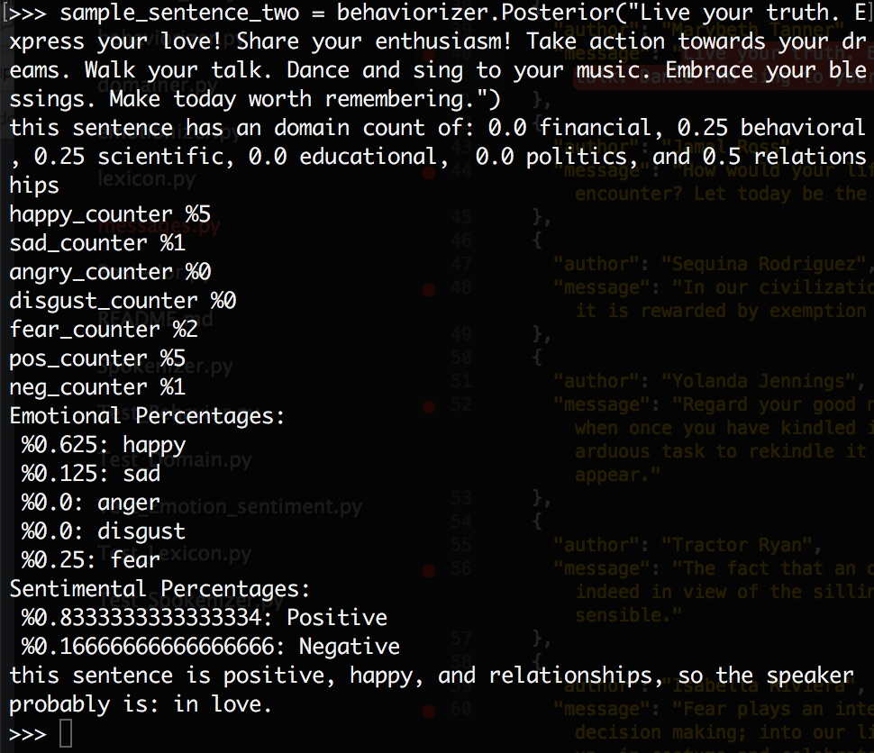

# Posterior Odds -- Language Analyzer
## Group Project for NSS Cohort 13, Python Back-End
### Group Members:
#### Megan Ford, Danielle Duer, Ben Wilburn, Melanie Baker, Whitney Mitchell
This project is intended to demonstrate our group's Python development skills at the time of creation.
The project was our very first group assignment in Python, and was designed to help us learn test-driven development, and practice using inheritance, composition, and aggregation to build our knowledge of Python. We built our v1.0 over the course of 1 week. The instructions provided to us for the project can be viewed below along with our installation instructions.
As a team, our goals were:
1. to create an app structure that all of us thoroughly understood
2. to focus on testable results and MVP (getting the expected results) rather than real-world accuracy
3. Learn how to plan and write Python tests and code
## Installation
1. Clone the project repo down from github. In your terminal, type:
    ```
    git clone https://github.com/nss-day-cohort-13/language-analyzer-the-posterior-odds.git
    cd language-analyzer-the-posterior-odds
    ```
2. Install NLTK (Natural Language Toolkit). From inside the project directory, in your terminal, type:
    ```
    pip install -U nltk
    ```
3. If you like, you can test it by typing:
    ```
    python
    import nltk
    ```

4. Now, you can actually use the language analyzer! Open the python interpreter and feed in a message. (Your message goes in the quotes.)
    ```
    python
    import behaviorizer
    var = behaviorizer.Posterior("Your message here")
    ```
This will give you a very silly behavior prediction, as well as a set of emotions, sentiments, and domains that were analyzed in your message.


### Project Instructions:
Language Analyzer Group Project
##### Information:
For this group project, design is of utmost importance. Team discussion, white boarding, and Trello cards will take up the majority of the time. You must consider the relationships between the different components. You must consider the inputs for behavior and the expected output.
Also put significant thought into how inheritance, composition, and aggregation patterns will be used to create the relationships between all the modules.
##### Requirements:
A full test suite. There should be no logic in your project for which there is not a test.
Documentation. Every class, and every method should have a docstring.
Language Analyzer
The language analyzer is the main module that will use sentiment analysis, and behavior prediction to produce a report for each person's message.
Example output:
(Yours does not have to look like this. It's just an example:)
Message: "Suzy sells seashells by the seashore"
Sentiment:
    0.52 (Positive)

Behavior(s):
    0.58 (Aggressive)
    0.88 (Transaction)
Domain(s):
    0.925 (Financial)
##### Sentiment Analysis
Sentiment analysis is a complex topic, but for this project you will use these basic criteria in your module.
- Words stored in the sentiment key of the lexicon.
- Punctuation (e.g. exclamation points may increase the sentiment value)
- Behavior value

Given these criteria, produce a sentiment value between 0 and 1 for each message.
##### Behavior Predictor
This module will determine what behavior is expressed in a message. Use the following criteria.
Words stored in the behavior key of the lexicon.
Punctuation (e.g. question marks may indicate inquisitiveness, exclamation point may indicate aggressiveness)
Given these criteria, produce a behavior value between 0 and 1 for each message, for each behavior identified.
Instructor guidance: You may want to add more behaviors to the lexicon as you identify them.
##### Tokenizer
The tokenizer module will produce the following results for each message.
- Alphanumeric Characters
- Word count
- Word position
- Sentence count
- Punctuation
##### Domain Identifier
The domain identification module will determine the subject matter of the message. Use the following criteria.
- Words stored in the domain key of the lexicon.
- Punctuation
- Word count
Given these criteria, produce a domain value between 0 and 1 for each message, for each domain identified.
Instructor guidance: You may want to add more domains to the lexicon as you identify them.
Example:
Friendship is like money, easier made than kept.
There are two domains in this small quote.
Relationships
Financial
However, the word position of friendship, being at the beginning of the sentence, may indicate that is has a higher weight.
```
